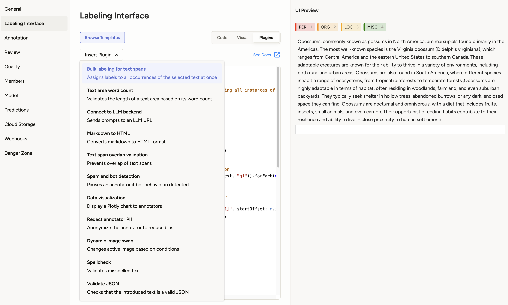

# Label Studio Custom Scripts

Welcome to **Label Studio Custom Scripts**! This repository contains `custom scripts` designed to extend the functionality of [Label Studio](https://labelstud.io), a powerful data labeling tool. These scripts can be used to automate workflows, integrate with external tools, and customize the labeling process according to your needs.

Whether you're building custom data processors, integrations, or UI components, you'll find the necessary resources and examples in this repo to get started.

## Official Documentation

For detailed documentation and guides on how to use and extend Label Studio with custom scripts, visit the official [Label Studio Scripts Documentation](https://docs.humansignal.com/guide/scripts).

## File Structure

This repository follows a clear folder structure to organize the various custom scripts and configuration files:

```bash
label-studio-custom-scripts/
├── custom-scripts/
│   ├── script1/
│   │   ├── data.{json|mp3|mp4}
│   │   ├── script.js
│   │   └── view.xml
│   ├── script2/
│   │   ├── data.{json|mp3|mp4}
│   │   ├── script.js
│   │   └── view.xml
│   └── ...
└── manifest.json
```

- **`/script1`**: Contains all the files to document a custom script.
  - Each script has a `script.js` and `view.xml` file that define the logic and UI of the script.
- **`/script.js`**: Contains the actual custom script `javascript` file that can be embedded in the Label Studio code editor.
- **`/view.xml`**: Stores an example of a `<View>` that will work along the script.
- **`/data.{json|mp3|mp4}`**: Stores an example of the data that can be used along with the script.
- **`manifest.json`**: This file lists the scripts, their metadata (title, description, etc.), and their paths for easy integration with Label Studio.

## Usage

After your script gets merged you will be able to find it in your project's **Labeling Interface**



## Contributing

We welcome contributions! Whether it's bug fixes or new scripts, feel free to open a pull request. Here's how you can get started:

1. **Create a new branch** for your feature or bugfix.
2. **Make your changes** and ensure that they adhere to the project's file structure and guidelines. You need to create a folder with the name using underscores (`path`) of your script and add a `view.xml` and a `script.js` file minimum.
3. **Register the script** in the `manifest.json` adding the following information:
   ```json
   [
      {
        "title": "Your script title",
        "description": "Your script description",
        "path": "exact_name_of_the_script_folder", // `script1` as per the File Structure example
        "private": false // whether you want to hide it in the "Insert Script" dropdown in the Configurator code tab
      }
   ]
   ```
4. **Test your changes** to ensure everything works as expected.
5. **Submit a pull request** explaining the changes you made.

Please make sure that your contributions follow the existing code style and structure.

## License

This software is licensed under the [Apache 2.0 LICENSE](/LICENSE) © [Heartex](https://www.heartex.com/). 2020-2025

---

If you have any questions or need assistance, feel free to reach out through issues or discussions. We look forward to your contributions!
